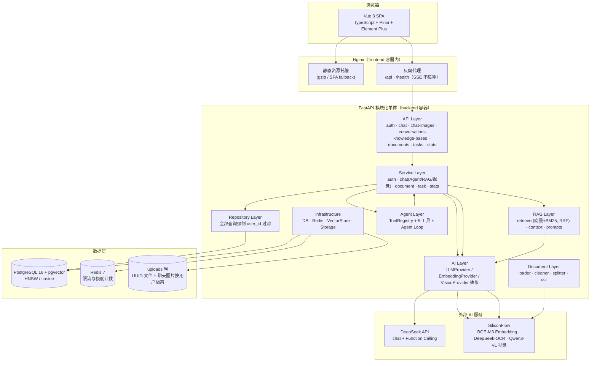

# AI Brain 架构设计

> 依据项目实际实现编写（TDD v0.2 的落地情况）。架构原则：模块化单体、一人可维护、可上线、不过度设计。

## 1. 系统整体架构



## 2. 技术栈与选型理由

| 层 | 选型 | 为什么 |
|---|---|---|
| 前端 | Vue 3 + TypeScript + Vite + Pinia + Element Plus | 既定技术栈；Vite 构建快；组合式 API + 严格类型 |
| 后端 | Python 3.12 + FastAPI + SQLAlchemy 2.0(async) + Alembic | FastAPI 原生 async/SSE；SQLAlchemy 2.0 类型安全；Alembic 迁移可追溯 |
| 数据库 | **PostgreSQL 16 + pgvector（单库）** | 一个数据库同时承载关系数据与向量（HNSW/cosine），组件最少、事务一致；个人规模性能充裕 |
| 缓存/限流 | Redis 7 | 仅承担接口限流与 AI 额度计数两项职责（避免职责蔓延） |
| LLM | DeepSeek（OpenAI 兼容协议） | 中文能力强、成本低；封装在 `DeepSeekProvider` 内，业务层只依赖 `LLMProvider` 接口，可替换 OpenAI/Claude/本地模型 |
| Embedding | SiliconFlow BGE-M3（1024 维，API） | DeepSeek 无 Embedding API，故 LLM 与 Embedding 分离；BGE-M3 中英双语质量好、批量调用成本极低 |
| 混合检索 | 向量 Top-30 + BM25 Top-30（jieba 分词）→ RRF(k=60) 融合 Top-6 | 语义与关键词互补；BM25 进程内缓存以 (总数, max id) 作版本信号，删除文档后索引必然重建 |
| OCR | SiliconFlow DeepSeek-OCR（视觉模型） | 只对「无文字层」的 PDF 页调用（200 DPI 渲染），文字页零成本直通；复用 Embedding 同平台 Key |
| 视觉问答 | SiliconFlow Qwen3-VL-32B（OpenAI 兼容 vision 格式） | 聊天附图直答（不带工具/检索）；图片前端压缩（≤1280px）控制 token 成本；`VISION_MODEL` 可配置替换 |
| 文档解析 | PyMuPDF（PDF）/ 原生读取（TXT/MD） | 提取质量好；TXT 支持 UTF-8/GBK 编码探测 |
| 异步任务 | **进程内 asyncio + DB 状态机** | 文档解析唯一重任务；不引入 Celery（个人项目过度设计）；失败可「重新解析」兜底 |
| 部署 | Docker Compose + Nginx | 单机可运维；无 K8s（不符合当前规模） |
| CI | GitHub Actions | push 触发：后端测试 + 前端构建 |

## 3. 模块划分（后端分层）

```
app/
├── api/          # API Layer：路由、鉴权依赖、统一响应 {code, message, data}
├── services/     # Service Layer：业务编排、事务边界、AI 调用编排
├── repositories/ # Repository Layer：SQL 访问，所有查询强制 user_id 过滤
├── models/       # SQLAlchemy ORM（10 张表）
├── schemas/      # Pydantic v2 请求/响应模型
├── ai/           # AI Layer：LLMProvider / EmbeddingProvider / VisionProvider 抽象 + 实现 + factory
├── rag/          # RAG Layer：retriever（向量+BM25 双路 RRF）/ bm25 / fusion / context / prompts
├── agent/        # Agent Layer：ToolRegistry + 5 个工具 + Agent Loop 控制
├── document/     # Document Layer：loader / cleaner / splitter / ocr / pipeline
├── core/         # 配置、安全（bcrypt+JWT）、依赖注入、异常体系
└── infrastructure/ # DB 会话、Redis、VectorStore（pgvector）、文件存储
```

### 依赖方向铁律

```
API → Service → Repository → DB
Service/Agent → Provider 接口 ← AI 实现
```

- 业务层**禁止 import** DeepSeek/Embedding SDK（R1/R2）；
- Agent 工具**禁止**访问 Repository/DB，只能调 Service（R3）；
- Repository 所有查询方法**强制** `user_id` 参数（R4），前端传入的 user_id 一律忽略。

## 4. 核心链路设计

### RAG 问答

```
上传文档 → 解析(PyMuPDF) → PDF 无文字层页? → DeepSeek-OCR 提取并入 sections
        → 清洗 → 递归切分(600/100) → BGE-M3 批量向量化 → pgvector(HNSW/cosine)
提问 → 双路召回：Query Embedding 向量 Top-30(user_id+kb 过滤) + BM25 Top-30(jieba)
        → RRF(k=60) 融合取 Top-6 → Context 组装(4000 字符截断) → DeepSeek 流式
        → SSE delta + sources 引用来源
检索不足（向量路低于阈值且 BM25 无命中）→ 固定话术，不调 LLM 编造（诚实原则）
```

### 多模态视觉问答（聊天附图）

```
前端粘贴/选择图片 → canvas 压缩(≤1280px, JPEG 0.8) → POST /chat-images
   （魔数校验 + 5MB 限制 + 用户目录隔离 + UUID 文件名）
POST /chat(images=[name...]) → 读图转 base64 → Qwen3-VL vision 消息
   （本轮图片 + 历史文本上下文；不带工具、不检索）→ SSE 流式
历史消息经 GET /chat-images/{name}（JWT + 归属校验）重新加载显示
```

### Agent Tool Calling

```
用户消息 → LLM(messages + 5 个工具 JSON Schema)
        → 模型返回 tool_calls → 逐个执行（参数校验 + user_id 权限）
        → 结果回填(role=tool) → 记录 agent_tool_calls → 循环（最大 5 轮）
        → 模型不再调用工具 → 最终回答流式输出
SSE 事件：delta / tool(running/done/failed) / sources / done / error
```

### SSE 流式

- 后端 `StreamingResponse(text/event-stream)`，逐 delta 事件；
- 前端 `fetch + ReadableStream` 手动解析（EventSource 不支持 POST+Header），`AbortController` 支持停止生成；
- Nginx 必须 `proxy_buffering off`（否则流式退化为一次性返回）。
