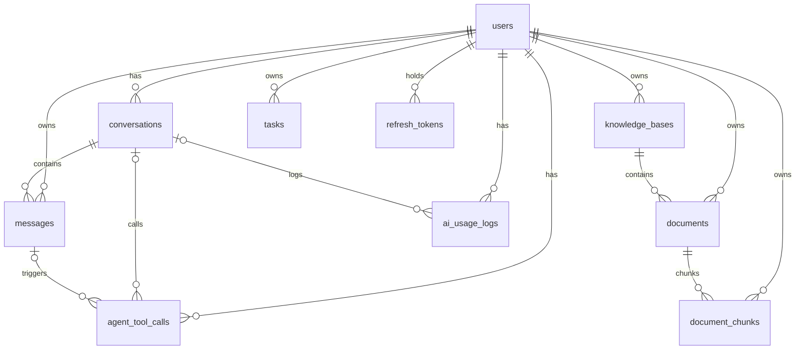

# AI Brain 数据库设计

> PostgreSQL 16 + pgvector 0.7+，单库方案。10 张核心表 + `alembic_version`（Alembic 元数据）。
> 11 个迁移（`0001~0011`）已按序执行，见 `backend/alembic/versions/`。

## 1. ER 图



## 2. 表清单与关键字段

| 表 | 关键字段 | 说明 |
|---|---|---|
| `users` | username(UNIQUE), email(UNIQUE 可空), password_hash(bcrypt), role(user/admin) | 无删除功能 |
| `refresh_tokens` | user_id, token_hash(SHA-256, UNIQUE), expires_at | 只存哈希不存明文；轮换防重放 |
| `conversations` | user_id, title, deleted_at | 软删 |
| `messages` | conversation_id, user_id(冗余隔离), role(user/assistant), content, model, **images(JSONB 图片文件名列表)** | 只追加 |
| `knowledge_bases` | user_id, name, description, deleted_at | 软删 |
| `documents` | user_id, knowledge_base_id, filename, stored_path(UUID), file_type, file_size, status(uploaded/parsing/ready/failed), error_message, chunk_count, deleted_at | 状态机 + 软删 |
| `document_chunks` | user_id(冗余), document_id, knowledge_base_id(冗余), seq, content, char_count, metadata(JSONB 页码), **embedding vector(1024)** | 不可变，物理删 |
| `tasks` | user_id, title, description, status(todo/in_progress/done), priority(high/medium/low), due_date, deleted_at | 软删 |
| `ai_usage_logs` | user_id, conversation_id(可空 SET NULL), type(chat/rag/agent/summary/vision), model, prompt_tokens, completion_tokens, total_tokens, latency_ms, status, error_message | 只追加 |
| `agent_tool_calls` | user_id, conversation_id/message_id(可空), tool_name, arguments(JSONB), result(JSONB), status, latency_ms | 工具调用审计 |

## 3. 设计要点

- **主键**：BIGSERIAL（BIGINT 自增）；时间字段 TIMESTAMPTZ（UTC）。
- **枚举**：VARCHAR + CHECK 约束（比 PG ENUM 迁移友好）。
- **冗余 user_id**：messages / documents / document_chunks 冗余 `user_id`，隔离查询与向量检索**不 join**；一致性由 Service 层保证（冗余值从已校验父记录复制，铁律 S1~S3）。
- **软删除**：会话/知识库/文档/任务用 `deleted_at`；chunks 物理删除（向量必须释放空间）。
- **Refresh Token 安全**：库中只存 SHA-256 哈希，轮换时旧哈希作废；登录态无法通过拖库还原。
- **外键级联**：物理删除父记录时 `ON DELETE CASCADE`；日志/工具调用的 conversation_id 用 `ON DELETE SET NULL`（保留审计）。

## 4. pgvector 设计

- 扩展：`CREATE EXTENSION IF NOT EXISTS vector`（迁移 0004，先于 document_chunks）。
- 向量列：`embedding vector(1024)`，与 BGE-M3 维度一致；**更换模型必须全量重建向量**。
- 索引：`USING hnsw (embedding vector_cosine_ops) WITH (m=16, ef_construction=64)`。
- 检索（含数据隔离）：

```sql
SELECT dc.*, d.filename, 1 - (dc.embedding <=> :query) AS similarity
FROM document_chunks dc
JOIN documents d ON d.id = dc.document_id AND d.deleted_at IS NULL
WHERE dc.user_id = :user_id AND dc.knowledge_base_id IN (:kb_ids)
ORDER BY dc.embedding <=> :query
LIMIT :k;
```

## 5. 索引清单（对应真实查询）

| 索引 | 场景 |
|---|---|
| conversations(user_id, updated_at DESC) | 会话列表 |
| messages(conversation_id, created_at) / (user_id) | 历史消息 / 隔离 |
| knowledge_bases(user_id, updated_at DESC) | 知识库列表 |
| documents(knowledge_base_id, created_at DESC) / (user_id) | 文档列表 / 隔离 |
| document_chunks **HNSW(embedding)** | 向量检索 |
| document_chunks(document_id, seq) / (user_id, knowledge_base_id) | 顺序与级联 / 检索过滤 |
| tasks(user_id, status) | 任务筛选 |
| ai_usage_logs(user_id, created_at DESC) | 用量统计 |
| agent_tool_calls(user_id, created_at DESC) / (conversation_id) | 审计 / 会话轨迹 |
| refresh_tokens(token_hash UNIQUE) / (user_id) | 刷新令牌查询 / 用户维度撤销 |
